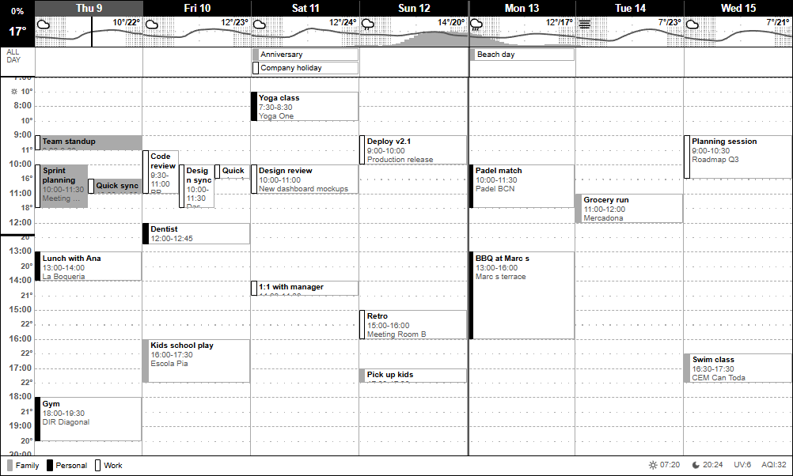

# TRMNL Calendar + Weather Plugin

A custom [TRMNL](https://usetrmnl.com) plugin that combines your **Google Calendar** weekly view with a **7-day weather forecast** and **air quality** data. Designed for the TRMNL OG (2-bit grayscale, 800x480px).



## Features

- **Time-grid weekly calendar** - Events positioned at their actual time slots, just like Google Calendar
- **Multiple Google Calendars** - Each calendar gets a distinct grayscale bar pattern (supports up to 11 calendars)
- **Overlapping events** - Displayed side by side automatically
- **Weather forecast per day** - Icon + min/max temperature in a compact header row
- **Hourly weather charts** - Precipitation probability bars + temperature line behind each day's header
- **Hourly forecast on time axis** - Shows temperature or rain probability (when >= 40%) at each half-hour mark
- **Current conditions** - Current temperature and today's rain probability in the top-left corner
- **Sunrise/sunset, UV index, air quality** - Displayed in the bottom legend row
- **Current time indicator** - Bold tick on the time axis
- **Past events dimmed** - Lighter background for events that have already ended
- **Week start separator** - Darker vertical line at the configured first day of the week
- **All-day events** - Displayed in a dedicated strip with calendar color bars
- **Event details** - Location and description shown for longer events
- **Graceful degradation** - Works with partial data (calendar only, weather only, or both)
- **2-bit optimized** - Uses only the 4 native grayscale shades (black, gray-30, gray-55, white)

## Prerequisites

- A **TRMNL device** (OG, 2-bit) with **Developer perks** enabled (comes with BYOD or Developer Edition)
- **Google Calendar** connected to TRMNL

## Setup

### Step 1: Connect Google Calendar

1. Log in to [trmnl.com](https://trmnl.com)
2. Go to **Plugins** > search **Google Calendar** > **Add**
3. Follow the Google OAuth flow to connect your account
4. **Select all calendars** you want to display (hold Ctrl/Cmd to multi-select)
5. Set the layout to **Week** (recommended - see [why](#why-week-layout))
6. Save

After saving, note the **plugin_setting_id** from the URL:

```
https://usetrmnl.com/plugin_settings/12345/edit
                                     ^^^^^
                                  this number
```

### Step 2: Get your API key

Go to [trmnl.com/account](https://trmnl.com/account) and copy your **API key**.

### Step 3: Create the Private Plugin

1. Go to **Plugins** > search **Private Plugin** > **Create**
2. Configure:
   - **Name:** `Calendar + Weather`
   - **Strategy:** `Polling`
   - **Polling URL(s)** (one per line, replace `YOUR_CALENDAR_ID` and your coordinates/timezone):

```
https://usetrmnl.com/api/plugin_settings/YOUR_CALENDAR_ID/data
https://api.open-meteo.com/v1/forecast?latitude=YOUR_LAT&longitude=YOUR_LON&daily=temperature_2m_max,temperature_2m_min,weather_code,precipitation_probability_max,sunrise,sunset,uv_index_max&hourly=temperature_2m,precipitation_probability&current=temperature_2m&timezone=YOUR_TIMEZONE&forecast_days=7
https://air-quality-api.open-meteo.com/v1/air-quality?latitude=YOUR_LAT&longitude=YOUR_LON&current=european_aqi&timezone=YOUR_TIMEZONE
```

   - **Polling Verb:** `GET`
   - **Polling Headers:**

```
authorization=bearer YOUR_API_KEY
```

3. Save

> The Open-Meteo URLs don't require authentication. They silently ignore the auth header.

> The third URL (air quality) is optional. Remove it if you don't need AQI data.

### Step 4: Add the template

1. Open your Private Plugin's settings
2. Go to the **Markup** tab (Full view)
3. Copy the entire contents of [`src/full.liquid`](src/full.liquid) and paste it in
4. Save

### Step 5: Test

1. Click **Force Refresh** on the plugin page
2. Wait ~30 seconds for data to be polled and rendered
3. Check your TRMNL device

### Step 6: Keep the Google Calendar plugin in a playlist

The Google Calendar plugin must remain in an **active playlist** for TRMNL to keep refreshing its data. If it's removed from all playlists, the data goes stale and events will eventually stop appearing in this plugin.

**Recommended approach:** Add the Google Calendar plugin to a playlist and mark it as **hidden**. TRMNL shows a "Refresh paused" warning but the tooltip clarifies that "Data sync is active", meaning Google Calendar data should keep refreshing without the plugin ever appearing on your screen.

**Fallback:** If you notice calendar data going stale while the plugin is hidden, switch to setting it with a **1-minute duration** instead. This guarantees data stays fresh while minimizing how often it appears on your device.

> **Important:** Do not remove the Google Calendar plugin from all playlists. Even though this plugin polls its data via the API, TRMNL only refreshes the underlying Google Calendar sync when the plugin is part of an active playlist. See [Troubleshooting](TROUBLESHOOTING.md#calendar-data-goes-stale-or-events-stop-appearing) if events stop appearing.

## Customization

### Change location

Replace the latitude, longitude, and timezone in the Open-Meteo URLs:

| Parameter | Example |
|-----------|---------|
| `latitude` | `41.39` (Barcelona) |
| `longitude` | `2.17` (Barcelona) |
| `timezone` | `Europe/Madrid` |

Find your coordinates at [open-meteo.com](https://open-meteo.com/en/docs).

### Calendar bar patterns

Calendars are automatically assigned visual patterns based on alphabetical order of their names. The 11 available patterns cycle through:

| # | Style |
|---|-------|
| 1 | Solid light gray |
| 2 | Solid black |
| 3 | White with black border |
| 4 | Gray diagonal stripes |
| 5 | Black diagonal stripes (reversed) |
| 6 | Gray horizontal stripes |
| 7 | Gray vertical stripes |
| 8 | Black horizontal stripes |
| 9 | Black vertical stripes |
| 10 | Gray diagonal stripes (reversed) |
| 11 | Black diagonal stripes |

Calendar names are resolved from email addresses using Google Calendar's display names.

### Temperature units

Open-Meteo returns Celsius by default. For Fahrenheit, add `&temperature_unit=fahrenheit` to the weather URL.

## Local development

You can preview the plugin locally using [trmnlp](https://github.com/usetrmnl/trmnlp):

```bash
gem install trmnl_preview
cd trmnl-cal-weather
trmnlp serve
```

The `.trmnlp.yml` file includes sample data. The template auto-detects the trmnlp environment and reads data from custom fields.

## Architecture

```
TRMNL Polling (every ~15 min)
    |
    +--> IDX_0: TRMNL Calendar API    (events + calendar names)
    |
    +--> IDX_1: Open-Meteo Forecast   (daily + hourly + current)
    |
    +--> IDX_2: Open-Meteo Air Quality (optional, European AQI)
              |
        Liquid Template (full.liquid)
              |
        JS builds time-grid layout
        groups events by date
        positions at actual time slots
        handles overlaps side-by-side
              |
        Rendered to 800x480 e-ink bitmap
```

## Data sources

- **Calendar:** TRMNL's parsed Google Calendar data (handles OAuth, sync, timezone)
- **Weather:** [Open-Meteo](https://open-meteo.com) free forecast API (no key, no registration)
- **Air Quality:** [Open-Meteo Air Quality API](https://open-meteo.com/en/docs/air-quality-api) (European AQI, optional)

## Why "Week" layout?

The plugin displays 7 days regardless of which Google Calendar layout you choose. "Month" or "Day" layouts work but return significantly more data (a month view can include 80-100+ events across 6 weeks). Since TRMNL has a data size limit for plugin payloads, larger responses risk being truncated mid-stream, which causes the calendar to fail silently. "Week" keeps the payload small and avoids this issue.

## Troubleshooting

The plugin includes a **built-in diagnostic overlay** that appears on-screen when data issues are detected (e.g., missing calendar data, unexpected format, empty events). This makes it easier to identify problems without needing browser access.

After any configuration change, **save the plugin** (top right) and click **Force Refresh** to generate a new preview image. Some changes take time to propagate, especially Google Calendar updates.

For detailed debugging steps, see **[TROUBLESHOOTING.md](TROUBLESHOOTING.md)**.
